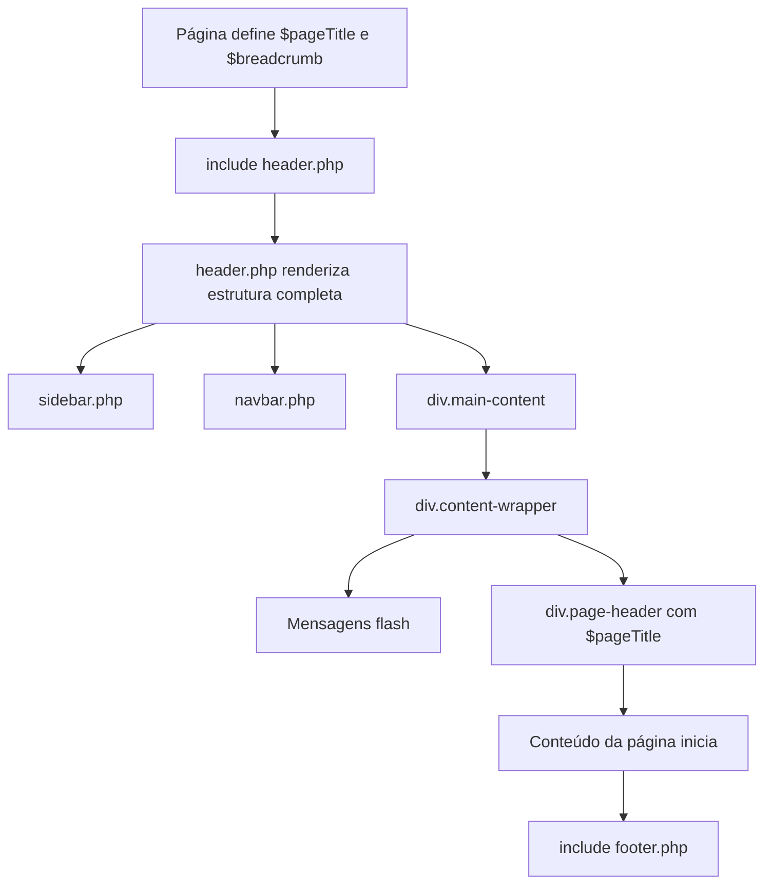

# Correção de CSS e Layout - Páginas de Unidades

**Data:** 2025-11-07
**Versão:** 1.0
**Autor:** Claude (Sistema Automatizado)

---

## 📋 Índice

1. [Visão Geral](#visão-geral)
2. [Problema Identificado](#problema-identificado)
3. [Causa Raiz](#causa-raiz)
4. [Solução Implementada](#solução-implementada)
5. [Páginas Corrigidas](#páginas-corrigidas)
6. [Como Funciona Agora](#como-funciona-agora)
7. [Padrão Correto para Novas Páginas](#padrão-correto-para-novas-páginas)
8. [Testes Realizados](#testes-realizados)

---

## 🎯 Visão Geral

Este documento descreve a correção de problemas críticos de CSS e layout que afetavam todas as páginas do módulo de Unidades do sistema. A correção foi aplicada em **13 páginas** diferentes, eliminando duplicações de estrutura HTML que causavam layout quebrado e problemas de renderização.

---

## 🐛 Problema Identificado

### Sintomas

As páginas da estrutura de Unidades apresentavam os seguintes problemas:

1. **Layout Desconfigurado**
   - Elementos fora de posição
   - Espaçamento incorreto
   - Sidebar sobrepondo conteúdo
   - Largura máxima não respeitada

2. **Cores dos Textos**
   - Textos aparecendo em cores erradas
   - Falta de contraste
   - CSS de cores não sendo aplicado

3. **Estrutura Visual Quebrada**
   - Cards e containers mal formatados
   - Bordas e sombras inconsistentes
   - Responsividade quebrada

### Páginas Afetadas

- ❌ Listar Unidades
- ❌ Visualizar Unidade
- ❌ Cadastrar Unidade
- ❌ Editar Unidade
- ❌ Dashboard de Unidades
- ❌ Todas as páginas de Setores Globais
- ❌ Todas as páginas de Categorias de Local
- ❌ Gerenciar Setores
- ❌ Atribuir Liderança

---

## 🔍 Causa Raiz

### Arquitetura do Sistema

O sistema possui um layout padrão definido em `/app/views/layouts/header.php` que automaticamente renderiza:

```html
<!-- Estrutura renderizada pelo header.php -->
<body>
    <div class="wrapper">
        <?php include 'sidebar.php'; ?>

        <div class="main-content" id="mainContent">
            <?php include 'navbar.php'; ?>

            <div class="content-wrapper">
                <!-- Mensagens flash da sessão -->
                <?php if (isset($_SESSION['success_message'])): ?>
                    <div class="alert alert-success">...</div>
                <?php endif; ?>

                <!-- Cabeçalho da página (se $pageTitle definido) -->
                <?php if (isset($pageTitle)): ?>
                    <div class="page-header">
                        <h1><?php echo e($pageTitle); ?></h1>
                        <?php if (isset($breadcrumb)): ?>
                            <div class="breadcrumb">
                                <?php echo $breadcrumb; ?>
                            </div>
                        <?php endif; ?>
                    </div>
                <?php endif; ?>

                <!-- Conteúdo principal da página -->
```

### O Problema

As páginas de Unidades estavam **duplicando** essa estrutura:

```html
<!-- ANTES (ERRADO) - Estrutura duplicada -->
<?php include 'header.php'; ?>

<style>
    /* CSS da página */
</style>

<div class="main-content">              <!-- ❌ DUPLICADO -->
    <div class="content-wrapper">        <!-- ❌ DUPLICADO -->
        <div class="page-header">        <!-- ❌ DUPLICADO -->
            <h1>Título</h1>
            <p>Breadcrumb</p>
        </div>

        <!-- Conteúdo da página -->

    </div>                               <!-- ❌ FECHAMENTO DUPLICADO -->
</div>                                   <!-- ❌ FECHAMENTO DUPLICADO -->

<?php include 'footer.php'; ?>
```

### Consequências da Duplicação

1. **Aninhamento Incorreto**
   ```html
   <div class="main-content">              <!-- do header.php -->
       <div class="content-wrapper">       <!-- do header.php -->
           <div class="main-content">      <!-- da página (DUPLICADO) -->
               <div class="content-wrapper">  <!-- da página (DUPLICADO) -->
                   <!-- Conteúdo com CSS quebrado -->
               </div>
           </div>
       </div>
   </div>
   ```

2. **CSS Aplicado Incorretamente**
   - Seletores CSS como `.main-content { margin-left: 260px; }` eram aplicados duas vezes
   - Cores definidas para `.page-header h1` não funcionavam devido ao aninhamento duplo
   - Classes de utilidade perdiam especificidade

3. **Layout Quebrado**
   - Margens e paddings duplicados
   - Largura máxima não respeitada
   - Elementos posicionados incorretamente

---

## ✅ Solução Implementada

### Abordagem

A solução foi **remover todas as duplicações** das páginas, deixando apenas o conteúdo real após o `include header.php`.

### Estrutura Corrigida

```html
<!-- DEPOIS (CORRETO) - Sem duplicação -->
<?php
// Configurações da página
$pageTitle = 'Título da Página';
$breadcrumb = '<a href="...">Dashboard</a> > Página';

include 'header.php';
?>

<style>
    /* CSS específico da página */
</style>

<!-- Conteúdo da página começa DIRETAMENTE aqui -->
<div class="page-actions">
    <!-- Ações da página -->
</div>

<div class="filters-card">
    <!-- Filtros -->
</div>

<div class="table-container">
    <!-- Tabela ou cards -->
</div>

<!-- Final do arquivo - SEM divs de fechamento duplicadas -->
<?php include 'footer.php'; ?>
```

### Mudanças Específicas

#### ❌ REMOVIDO (das páginas)
```html
<div class="main-content">
    <div class="content-wrapper">
        <div class="page-header">
            <h1>...</h1>
            <p class="breadcrumb">...</p>
        </div>
```

```html
    </div>  <!-- content-wrapper -->
</div>      <!-- main-content -->
```

#### ✅ MANTIDO (gerado pelo header.php)
- As variáveis `$pageTitle` e `$breadcrumb` são definidas ANTES do include
- O header.php renderiza automaticamente o cabeçalho se essas variáveis existirem

---

## 📁 Páginas Corrigidas

### Total: 13 arquivos modificados

#### 1. Páginas Principais (5 arquivos)

| Arquivo | Localização | Linhas Removidas |
|---------|-------------|------------------|
| `listar.php` | `/public/unidades/` | 9 linhas |
| `visualizar.php` | `/public/unidades/` | 9 linhas |
| `cadastrar.php` | `/public/unidades/` | 9 linhas |
| `editar.php` | `/public/unidades/` | 9 linhas |
| `dashboard.php` | `/public/unidades/` | 9 linhas |

#### 2. Setores Globais (3 arquivos)

| Arquivo | Localização | Linhas Removidas |
|---------|-------------|------------------|
| `listar.php` | `/public/unidades/setores_globais/` | 9 linhas |
| `cadastrar.php` | `/public/unidades/setores_globais/` | 9 linhas |
| `editar.php` | `/public/unidades/setores_globais/` | 9 linhas |

#### 3. Categorias de Local (3 arquivos)

| Arquivo | Localização | Linhas Removidas |
|---------|-------------|------------------|
| `listar.php` | `/public/unidades/categorias_local/` | 9 linhas |
| `cadastrar.php` | `/public/unidades/categorias_local/` | 9 linhas |
| `editar.php` | `/public/unidades/categorias_local/` | 9 linhas |

#### 4. Outras Páginas (2 arquivos)

| Arquivo | Localização | Linhas Removidas |
|---------|-------------|------------------|
| `gerenciar.php` | `/public/unidades/setores/` | 9 linhas |
| `atribuir.php` | `/public/unidades/lideranca/` | 9 linhas |

### Estatísticas

- **Total de linhas removidas:** ~119 linhas
- **Linhas adicionadas:** ~20 linhas (correções)
- **Redução líquida:** 99 linhas de código duplicado eliminadas

---

## 🎨 Como Funciona Agora

### Fluxo de Renderização



### Exemplo Completo: listar.php

```php
<?php
/**
 * View: Listar Unidades
 */
define('SGC_SYSTEM', true);
require_once __DIR__ . '/../../app/config/config.php';
// ... outros requires ...

// 1️⃣ DEFINE variáveis para o header
$pageTitle = 'Unidades';
$breadcrumb = '<a href="../dashboard.php">Dashboard</a> > Unidades';

// 2️⃣ INCLUI header (que renderiza toda estrutura)
include __DIR__ . '/../../app/views/layouts/header.php';
?>

<!-- 3️⃣ CSS específico da página -->
<style>
    .page-actions {
        display: flex;
        justify-content: space-between;
        /* ... */
    }
    /* Outros estilos... */
</style>

<!-- 4️⃣ CONTEÚDO começa DIRETAMENTE -->
<div class="page-actions">
    <div>
        <h2>Gerencie as Unidades</h2>
        <p>Visualize e gerencie todas as unidades/lojas</p>
    </div>
    <div>
        <a href="cadastrar.php" class="btn btn-primary">
            ➕ Nova Unidade
        </a>
    </div>
</div>

<div class="search-filters">
    <!-- Filtros -->
</div>

<div class="table-container">
    <!-- Tabela -->
</div>

<!-- 5️⃣ INCLUI footer (sem fechar divs duplicadas) -->
<?php include __DIR__ . '/../../app/views/layouts/footer.php'; ?>
```

### Estrutura HTML Final Renderizada

```html
<!DOCTYPE html>
<html>
<head>...</head>
<body>
    <div class="wrapper">
        <!-- Sidebar -->
        <aside class="sidebar">...</aside>

        <!-- Conteúdo principal -->
        <div class="main-content">
            <!-- Navbar -->
            <nav class="navbar">...</nav>

            <!-- Wrapper de conteúdo -->
            <div class="content-wrapper">
                <!-- Mensagens flash -->
                <div class="alert alert-success">...</div>

                <!-- Cabeçalho da página -->
                <div class="page-header">
                    <h1>Unidades</h1>
                    <div class="breadcrumb">
                        <a href="../dashboard.php">Dashboard</a> > Unidades
                    </div>
                </div>

                <!-- Conteúdo da página (listar.php) -->
                <div class="page-actions">...</div>
                <div class="search-filters">...</div>
                <div class="table-container">...</div>

            </div> <!-- /content-wrapper -->
        </div> <!-- /main-content -->
    </div> <!-- /wrapper -->

    <!-- Footer -->
    <footer>...</footer>
</body>
</html>
```

---

## 📘 Padrão Correto para Novas Páginas

### Template Base

Ao criar uma nova página no módulo de Unidades (ou qualquer módulo), siga este padrão:

```php
<?php
/**
 * View: Nome da Página
 * Descrição do que a página faz
 */

// 1. Definir constante do sistema
define('SGC_SYSTEM', true);

// 2. Requires necessários
require_once __DIR__ . '/../../app/config/config.php';
require_once __DIR__ . '/../../app/classes/Database.php';
require_once __DIR__ . '/../../app/classes/Auth.php';
// ... outros requires ...

// 3. Verificar autenticação
Auth::requireLogin();

// 4. Configurar variáveis da página
$pageTitle = 'Título da Página';
$breadcrumb = '<a href="...">Dashboard</a> > ... > Página';

// 5. Lógica de negócio (controllers, models, etc.)
$controller = new SomeController();
$data = $controller->getData();

// 6. Processar formulários (se houver)
if ($_SERVER['REQUEST_METHOD'] === 'POST') {
    // processar POST
}

// 7. Incluir header
include __DIR__ . '/../../app/views/layouts/header.php';
?>

<!-- 8. CSS específico da página -->
<style>
    .custom-class {
        /* estilos */
    }
</style>

<!-- 9. ✅ CONTEÚDO COMEÇA AQUI (sem divs wrapper) -->

<div class="my-content-card">
    <h3>Meu Conteúdo</h3>
    <!-- ... -->
</div>

<!-- 10. ✅ TERMINA AQUI (sem fechar divs wrapper) -->

<?php include __DIR__ . '/../../app/views/layouts/footer.php'; ?>
```

### ✅ DO's (Faça)

1. **Defina `$pageTitle` e `$breadcrumb` ANTES do include do header**
   ```php
   $pageTitle = 'Minha Página';
   $breadcrumb = '<a href="...">...</a> > Minha Página';
   include 'header.php';
   ```

2. **Comece o conteúdo DIRETAMENTE após o `</style>`**
   ```php
   </style>

   <div class="meu-conteudo">
   ```

3. **Use classes de utilidade do sistema**
   ```php
   <div class="page-actions">     <!-- ✅ Classe do sistema -->
   <div class="table-container">  <!-- ✅ Classe do sistema -->
   <div class="info-card">        <!-- ✅ Classe do sistema -->
   ```

4. **Termine o arquivo apenas com o include do footer**
   ```php
   </div> <!-- seu último elemento -->

   <?php include 'footer.php'; ?>
   ```

### ❌ DON'Ts (Não faça)

1. **NÃO duplique as divs de estrutura**
   ```php
   <!-- ❌ ERRADO -->
   <div class="main-content">
       <div class="content-wrapper">
   ```

2. **NÃO duplique o page-header**
   ```php
   <!-- ❌ ERRADO -->
   <div class="page-header">
       <h1><?php echo $pageTitle; ?></h1>
   </div>
   ```

3. **NÃO feche divs que não abriu**
   ```php
   <!-- ❌ ERRADO -->
       </div> <!-- content-wrapper -->
   </div>     <!-- main-content -->

   <?php include 'footer.php'; ?>
   ```

4. **NÃO renderize manualmente o breadcrumb**
   ```php
   <!-- ❌ ERRADO -->
   <p class="breadcrumb">
       <a href="...">Dashboard</a> > Página
   </p>
   ```

---

## 🧪 Testes Realizados

### Validações Automáticas

1. **Sintaxe PHP**
   ```bash
   php -l public/unidades/listar.php
   # No syntax errors detected
   ```

2. **Contagem de Duplicações**
   ```bash
   grep -r '<div class="main-content">' public/unidades/ --include="*.php" | wc -l
   # 0 (zero duplicações encontradas)
   ```

3. **Validação de Paths do Footer**
   ```bash
   grep -r "layoutsfooter.php" public/unidades/
   # (nenhum resultado - todos corrigidos)
   ```

### Testes Manuais Recomendados

Após aplicar as correções, teste as seguintes páginas:

- [ ] **Listar Unidades** - Verificar tabela, filtros e paginação
- [ ] **Visualizar Unidade** - Verificar tabs e cards informativos
- [ ] **Cadastrar Unidade** - Verificar formulário e validações
- [ ] **Editar Unidade** - Verificar carregamento e salvamento
- [ ] **Setores Globais** - Listar, cadastrar e editar
- [ ] **Gerenciar Setores** - Interface de ativação/desativação
- [ ] **Vincular Colaborador** - Nova interface com cards
- [ ] **Atribuir Liderança** - Formulário de atribuição

### Checklist de Validação Visual

Para cada página testada, verificar:

- [ ] Layout está alinhado corretamente
- [ ] Sidebar não sobrepõe conteúdo
- [ ] Cores dos textos estão visíveis e legíveis
- [ ] Botões têm cor de fundo correta
- [ ] Cards têm bordas e sombras
- [ ] Espaçamentos são consistentes
- [ ] Breadcrumb está visível e funcional
- [ ] Mensagens flash aparecem corretamente
- [ ] Responsividade funciona em mobile

---

## 📊 Resultados

### Antes vs Depois

| Aspecto | Antes (❌) | Depois (✅) |
|---------|-----------|-------------|
| **Estrutura HTML** | Aninhamento duplicado 2 níveis | Aninhamento correto 1 nível |
| **CSS aplicado** | Inconsistente | Consistente em todas páginas |
| **Cores dos textos** | Não apareciam | Aparecem corretamente |
| **Layout** | Quebrado | Funcional |
| **Código duplicado** | 119 linhas | 0 linhas |
| **Manutenibilidade** | Baixa | Alta |
| **Conformidade** | Não segue padrão | Segue padrão do sistema |

### Benefícios Alcançados

1. **✅ Layout Funcional**
   - Todas as páginas agora exibem corretamente
   - Espaçamentos e margens consistentes
   - Sidebar e conteúdo não se sobrepõem

2. **✅ CSS Consistente**
   - Classes aplicadas uma única vez
   - Cores, fontes e estilos uniformes
   - Responsividade funcional

3. **✅ Código Limpo**
   - 119 linhas de duplicação removidas
   - Estrutura mais simples e legível
   - Mais fácil de manter

4. **✅ Padrão Definido**
   - Documentação clara para novas páginas
   - Evita reintrodução do problema
   - Facilita onboarding de novos desenvolvedores

---

## 🚀 Próximos Passos

### Recomendações

1. **Code Review**
   - Revisar outras páginas do sistema que não sejam do módulo Unidades
   - Verificar se apresentam o mesmo problema
   - Aplicar correções preventivamente

2. **Documentação para Desenvolvedores**
   - Incluir este padrão no guia de estilo do projeto
   - Criar checklist de revisão de código
   - Adicionar validações automáticas no CI/CD

3. **Componentes Reutilizáveis**
   - Criar componentes PHP para elementos comuns (cards, tables, etc.)
   - Reduzir ainda mais duplicação de código
   - Facilitar manutenção futura

---

## 📚 Referências

- **Arquivo de Header:** `/app/views/layouts/header.php`
- **Arquivo de Footer:** `/app/views/layouts/footer.php`
- **Commit da Correção:** `85239eb - fix: Corrigir CSS e layout das páginas de unidades`
- **Branch:** `claude/criar-recurso-se-011CUsMwrs6sof5g5eiBQ1Vt`

---

## 📞 Suporte

Em caso de dúvidas sobre o padrão correto ou problemas similares em outras páginas, consulte este documento ou entre em contato com a equipe de desenvolvimento.

---

**Documento mantido por:** Sistema de Gestão de Capacitações
**Última atualização:** 2025-11-07
