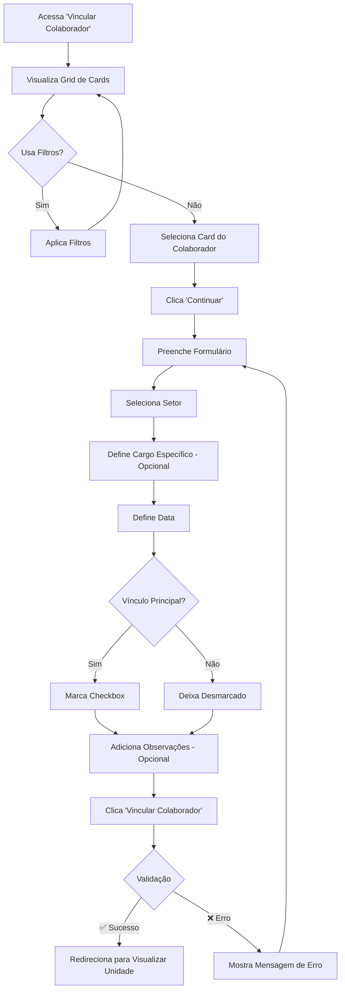
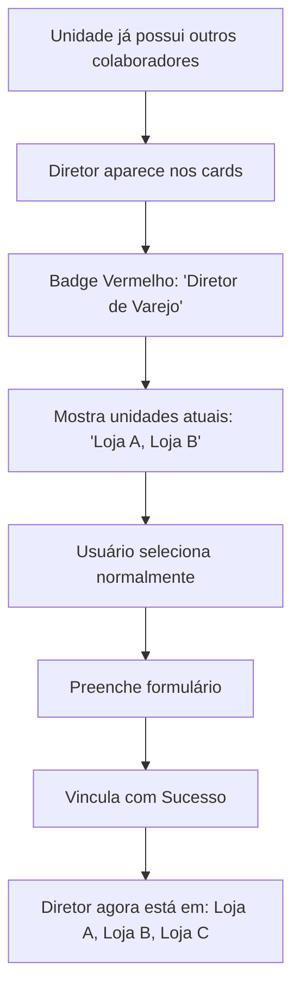
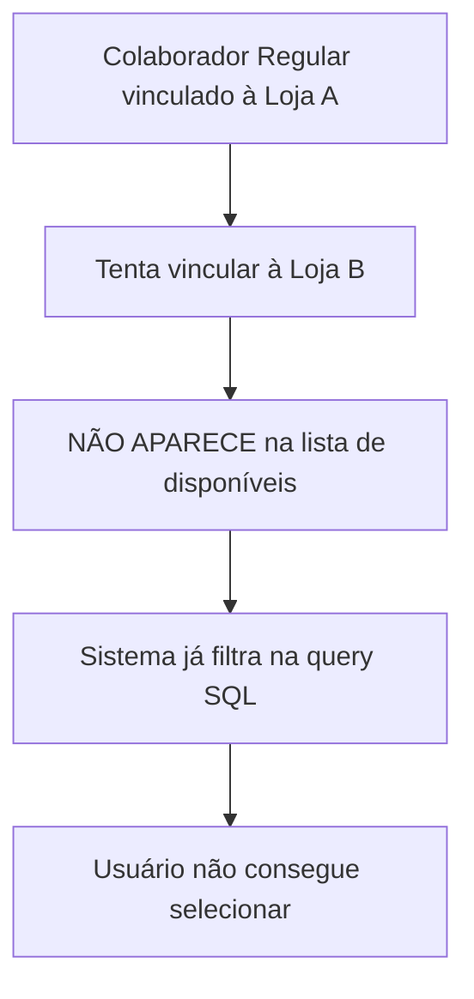
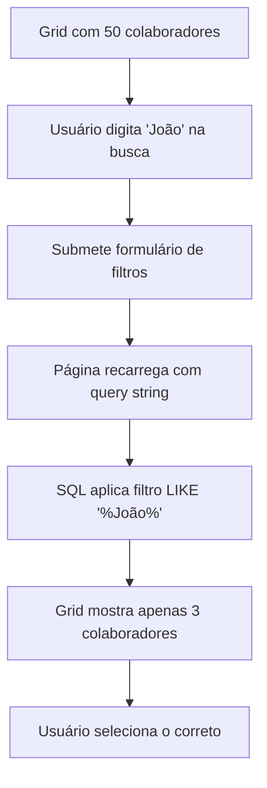

# Interface de Vinculação de Colaboradores - Card Selection

**Data:** 2025-11-07
**Versão:** 2.0
**Tipo:** Feature Enhancement
**Módulo:** Unidades > Colaboradores

---

## 📋 Índice

1. [Visão Geral](#visão-geral)
2. [Problema Anterior](#problema-anterior)
3. [Nova Solução](#nova-solução)
4. [Arquitetura Técnica](#arquitetura-técnica)
5. [Regras de Negócio](#regras-de-negócio)
6. [Interface do Usuário](#interface-do-usuário)
7. [Fluxo de Uso](#fluxo-de-uso)
8. [Implementação Técnica](#implementação-técnica)
9. [Testes e Validação](#testes-e-validação)
10. [Manutenção](#manutenção)

---

## 🎯 Visão Geral

A interface de vinculação de colaboradores foi completamente redesenhada para oferecer uma experiência visual e intuitiva, substituindo o sistema de busca/autocomplete por uma **seleção baseada em cards** (cartões visuais).

### Objetivos

- ✅ Facilitar a seleção visual de colaboradores
- ✅ Mostrar claramente quem pode ser vinculado a múltiplas unidades
- ✅ Exibir informações relevantes de cada colaborador
- ✅ Manter regras de negócio rigorosas
- ✅ Melhorar a experiência do usuário (UX)

### Resultado

Uma interface moderna e intuitiva que permite aos usuários:
- 👁️ **Ver** todos os colaboradores disponíveis em cards visuais
- 🔍 **Filtrar** por nome, cargo, departamento ou nível hierárquico
- ✅ **Selecionar** com um clique
- 📝 **Vincular** preenchendo apenas os dados necessários

---

## ⚠️ Problema Anterior

### Interface Antiga (v1.0)

**Arquivo:** `/public/unidades/colaboradores/vincular.php` (versão antiga)

```php
<!-- Campo de busca com autocomplete -->
<div class="search-container">
    <input type="text" id="search_colaborador"
           placeholder="Digite o nome ou email do colaborador...">
    <div class="search-results" id="searchResults"></div>
</div>
```

### Problemas Identificados

1. **❌ Campo de Busca Não Funcional**
   - O autocomplete não estava respondendo
   - Usuários precisavam digitar exatamente o nome
   - Difícil descobrir colaboradores disponíveis

2. **❌ Falta de Visibilidade**
   - Não era possível ver quem estava disponível
   - Sem indicação visual de quem pode estar em múltiplas unidades
   - Informações limitadas durante a seleção

3. **❌ UX Confusa**
   - Processo em etapa única sobrecarregado
   - Muitos campos ao mesmo tempo
   - Difícil entender as regras de vinculação

4. **❌ Sem Feedback Visual**
   - Não mostrava unidades atuais do colaborador
   - Sem indicação de Diretores de Varejo
   - Sem estatísticas ou contadores

### Feedback do Usuário

> "O recurso de vincular colaborador precisa ser mais fácil, o campo atual que pede para buscar digitando não está funcional, preciso que seja para selecionar o card do colaborador igual como é o vínculo de treinamentos"

---

## ✨ Nova Solução

### Interface Redesenhada (v2.0)

**Arquivo:** `/public/unidades/colaboradores/vincular.php` (versão nova)

#### 1️⃣ **Card-Based Selection**

Colaboradores são exibidos em **cards visuais** com todas as informações:

```
┌─────────────────────────────────────┐
│ ◉ João Silva                  [ ✓ ] │
│ 📧 joao.silva@empresa.com           │
│ 💼 Vendedor Senior                  │
│ 🏢 Vendas                            │
│                                      │
│ [👔 Diretor de Varejo] [Operacional]│
│ 📌 Atualmente em: Loja Centro       │
└─────────────────────────────────────┘
```

#### 2️⃣ **Filtros Avançados**

Sistema de filtros poderoso:

```
┌──────────────────────────────────────────────────────┐
│ 🔍 Buscar    💼 Cargo    🏢 Depto    📊 Nível  [Filtrar]│
└──────────────────────────────────────────────────────┘
```

#### 3️⃣ **Processo em 2 Etapas**

**Etapa 1:** Selecionar colaborador
- Grid de cards visual
- Seleção com radio button
- Informações completas no card

**Etapa 2:** Preencher dados de vinculação
- Setor
- Cargo específico
- Data de vinculação
- Vínculo principal (sim/não)
- Observações

#### 4️⃣ **Indicadores Visuais**

- 🔴 **Badge Vermelho:** Diretor de Varejo (pode estar em múltiplas unidades)
- 🔵 **Badge Azul:** Nível Estratégico
- 🟡 **Badge Amarelo:** Nível Tático
- 🟢 **Badge Verde:** Nível Operacional
- 📌 **Lista de Unidades:** Mostra onde o colaborador já está vinculado

---

## 🏗️ Arquitetura Técnica

### Camadas da Aplicação

```
┌─────────────────────────────────────────────┐
│           VIEW (vincular.php)               │
│  - Interface com cards                      │
│  - Filtros e formulário                     │
│  - JavaScript para seleção                  │
└───────────────┬─────────────────────────────┘
                │
┌───────────────▼─────────────────────────────┐
│     CONTROLLER                              │
│  UnidadeColaboradorController.php           │
│  - buscarColaboradoresDisponiveis()         │
│  - processarVinculacao()                    │
└───────────────┬─────────────────────────────┘
                │
┌───────────────▼─────────────────────────────┐
│     MODEL                                   │
│  UnidadeColaborador.php                     │
│  - buscarColaboradoresDisponiveis()         │
│  - vincularColaborador()                    │
│  - isDiretorVarejo()                        │
│  - verificarVinculoOutraUnidade()          │
└─────────────────────────────────────────────┘
```

### Arquivos Modificados/Criados

#### 1. Model: `/app/models/UnidadeColaborador.php`

**Método Novo:** `buscarColaboradoresDisponiveis()`

```php
public function buscarColaboradoresDisponiveis($unidadeId, $filtros = [])
```

**Responsabilidades:**
- Busca colaboradores ativos
- Aplica filtros (search, cargo, departamento, nivel)
- Aplica regra de negócio: exclui já vinculados a ESTA unidade
- Aplica regra de negócio: exclui regulares já vinculados a OUTRAS unidades
- Permite Diretores de Varejo aparecerem mesmo se já vinculados
- Retorna informações adicionais: is_diretor_varejo, unidades_vinculadas

**SQL Relevante:**
```sql
SELECT c.*,
    (SELECT COUNT(*) FROM unidade_lideranca ul
     WHERE ul.colaborador_id = c.id
       AND ul.cargo_lideranca = 'diretor_varejo'
       AND ul.ativo = 1
    ) as is_diretor_varejo,

    (SELECT GROUP_CONCAT(u.nome SEPARATOR ', ')
     FROM unidade_colaboradores uc
     INNER JOIN unidades u ON uc.unidade_id = u.id
     WHERE uc.colaborador_id = c.id AND uc.ativo = 1
    ) as unidades_vinculadas

FROM colaboradores c
WHERE c.ativo = 1
  AND c.id NOT IN (
      SELECT colaborador_id FROM unidade_colaboradores
      WHERE unidade_id = ? AND ativo = 1
  )
  AND (
      -- É diretor (pode estar em múltiplas)
      c.id IN (
          SELECT colaborador_id FROM unidade_lideranca
          WHERE cargo_lideranca = 'diretor_varejo' AND ativo = 1
      )
      OR
      -- Não está vinculado a nenhuma unidade
      c.id NOT IN (
          SELECT colaborador_id FROM unidade_colaboradores
          WHERE ativo = 1
      )
  )
```

#### 2. Controller: `/app/controllers/UnidadeColaboradorController.php`

**Método Novo:** `buscarColaboradoresDisponiveis()`

```php
public function buscarColaboradoresDisponiveis($unidadeId, $filtros = []) {
    return $this->model->buscarColaboradoresDisponiveis($unidadeId, $filtros);
}
```

Simplesmente repassa para o modelo.

#### 3. View: `/public/unidades/colaboradores/vincular.php`

**Estrutura da Página:**

```php
<?php
// 1. Setup
$pageTitle = 'Vincular Colaborador';
$unidadeId = $_GET['unidade_id'];

// 2. Busca dados
$setores = $controllerSetor->buscarPorUnidade($unidadeId, true);
$filtros = [
    'search' => $_GET['search'] ?? '',
    'cargo' => $_GET['cargo'] ?? '',
    'departamento' => $_GET['departamento'] ?? '',
    'nivel' => $_GET['nivel'] ?? ''
];
$colaboradoresDisponiveis = $controllerColaborador->buscarColaboradoresDisponiveis($unidadeId, $filtros);

include 'header.php';
?>

<!-- CSS -->
<style>
    .colaboradores-grid {
        display: grid;
        grid-template-columns: repeat(auto-fill, minmax(320px, 1fr));
        gap: 15px;
    }

    .colaborador-card {
        background: white;
        border: 2px solid #e1e8ed;
        border-radius: 10px;
        padding: 20px;
        cursor: pointer;
        transition: all 0.3s;
    }

    .colaborador-card.selected {
        border-color: #667eea;
        background: #f8f9ff;
    }
    /* ... */
</style>

<!-- Filtros -->
<div class="filters-card">
    <form method="GET">
        <input type="text" name="search" placeholder="Buscar...">
        <input type="text" name="cargo" placeholder="Cargo...">
        <input type="text" name="departamento" placeholder="Departamento...">
        <select name="nivel">
            <option value="">Todos</option>
            <option>Estratégico</option>
            <option>Tático</option>
            <option>Operacional</option>
        </select>
        <button type="submit">Filtrar</button>
    </form>
</div>

<!-- Grid de Cards -->
<div class="colaboradores-grid">
    <?php foreach ($colaboradoresDisponiveis as $colaborador): ?>
        <div class="colaborador-card" onclick="selecionarCard(<?php echo $colaborador['id']; ?>)">
            <input type="radio" name="colaborador_selecionado"
                   value="<?php echo $colaborador['id']; ?>"
                   data-nome="<?php echo e($colaborador['nome']); ?>"
                   data-diretor="<?php echo $colaborador['is_diretor_varejo'] ? '1' : '0'; ?>">

            <h4><?php echo e($colaborador['nome']); ?></h4>
            <p>📧 <?php echo e($colaborador['email']); ?></p>
            <p>💼 <?php echo e($colaborador['cargo']); ?></p>

            <?php if ($colaborador['is_diretor_varejo']): ?>
                <span class="badge badge-diretor">👔 Diretor de Varejo</span>
            <?php endif; ?>

            <?php if ($colaborador['unidades_vinculadas']): ?>
                <p>📌 Atualmente em: <?php echo e($colaborador['unidades_vinculadas']); ?></p>
            <?php endif; ?>
        </div>
    <?php endforeach; ?>
</div>

<!-- Formulário (hidden inicialmente) -->
<div class="vinculo-form-card" id="formularioVinculacao">
    <form method="POST">
        <input type="hidden" name="colaborador_id" id="colaborador_id_input">

        <select name="unidade_setor_id" required>
            <option value="">Selecione o setor...</option>
            <?php foreach ($setores as $setor): ?>
                <option value="<?php echo $setor['id']; ?>">
                    <?php echo e($setor['setor']); ?>
                </option>
            <?php endforeach; ?>
        </select>

        <input type="text" name="cargo_especifico" placeholder="Cargo específico...">
        <input type="date" name="data_vinculacao" value="<?php echo date('Y-m-d'); ?>">
        <input type="checkbox" name="is_vinculo_principal" value="1"> Vínculo Principal
        <textarea name="observacoes"></textarea>

        <button type="submit">💾 Vincular Colaborador</button>
    </form>
</div>

<!-- JavaScript -->
<script>
function selecionarCard(id) {
    const radio = document.getElementById('col-' + id);
    radio.checked = true;
    atualizarSelecao();
}

function atualizarSelecao() {
    // Remove selected de todos
    document.querySelectorAll('.colaborador-card').forEach(card => {
        card.classList.remove('selected');
    });

    // Adiciona selected ao selecionado
    const checked = document.querySelector('input[name="colaborador_selecionado"]:checked');
    if (checked) {
        checked.closest('.colaborador-card').classList.add('selected');
        document.getElementById('btnContinuar').disabled = false;
    }
}

function mostrarFormulario() {
    document.getElementById('colaboradoresGrid').style.display = 'none';
    document.getElementById('formularioVinculacao').classList.add('active');
}
</script>
```

---

## 📜 Regras de Negócio

### 1. **Vinculação Única (Regra Principal)**

**Colaboradores regulares podem estar vinculados a APENAS UMA unidade.**

```php
// Em UnidadeColaborador.php:vincularColaborador()
if (!$this->isDiretorVarejo($colaboradorId)) {
    $vinculoOutraUnidade = $this->verificarVinculoOutraUnidade($colaboradorId, $unidadeId);
    if ($vinculoOutraUnidade) {
        return [
            'success' => false,
            'message' => 'Este colaborador já está vinculado à unidade "' .
                        $vinculoOutraUnidade['unidade_nome'] .
                        '". Apenas Diretores de Varejo podem estar em múltiplas unidades.'
        ];
    }
}
```

### 2. **Exceção: Diretor de Varejo**

**Diretores de Varejo podem estar em MÚLTIPLAS unidades.**

```php
private function isDiretorVarejo($colaboradorId) {
    $sql = "SELECT COUNT(*) as total FROM unidade_lideranca
            WHERE colaborador_id = ?
              AND cargo_lideranca = 'diretor_varejo'
              AND ativo = 1";
    $stmt = $this->pdo->prepare($sql);
    $stmt->execute([$colaboradorId]);
    return $stmt->fetch()['total'] > 0;
}
```

**Como identificar:**
- Verificado na tabela `unidade_lideranca`
- Campo `cargo_lideranca = 'diretor_varejo'`
- Deve estar `ativo = 1`

### 3. **Colaboradores Disponíveis**

São considerados **disponíveis** para vinculação:

✅ **INCLUÍDOS:**
- Colaboradores ativos (`colaboradores.ativo = 1`)
- Que NÃO estão vinculados a ESTA unidade
- E que satisfazem UMA das condições:
  - São Diretores de Varejo (podem estar em outras unidades)
  - OU não estão vinculados a NENHUMA unidade

❌ **EXCLUÍDOS:**
- Colaboradores inativos
- Já vinculados a ESTA unidade
- Colaboradores regulares já vinculados a OUTRAS unidades

### 4. **Vínculo ao Setor**

- Colaborador é vinculado a um **setor específico da unidade**
- O setor deve estar **ativo** na unidade (`unidade_setores.ativo = 1`)
- O setor deve pertencer à unidade correta
- Não pode vincular ao mesmo setor duas vezes

### 5. **Vínculo Principal**

- Um colaborador pode ter **apenas um vínculo principal**
- Ao definir novo vínculo principal, o anterior é automaticamente removido
- Atualiza também `colaboradores.unidade_principal_id` e `colaboradores.setor_principal`

### 6. **Data de Vinculação**

- Obrigatória
- Padrão: data atual
- Pode ser retroativa (permitido)
- Não valida datas futuras (permitido para planejamento)

---

## 🎨 Interface do Usuário

### Componentes Visuais

#### 1. **Header da Página**

```
┌────────────────────────────────────────────────┐
│ 👥 Vincular Colaborador                        │
│                                                 │
│ 🏢 Unidade: Loja Centro                        │
│ 📍 Localização: São Paulo - SP                 │
└────────────────────────────────────────────────┘
```

#### 2. **Barra de Filtros**

```
┌────────────────────────────────────────────────┐
│ Filtros                                         │
│                                                 │
│ [🔍 Buscar...] [💼 Cargo...] [🏢 Depto...] [...│
│                                                 │
│ [📊 Nível ▼]  [Filtrar]                        │
└────────────────────────────────────────────────┘
```

**Campos:**
- **Buscar:** Nome, email ou cargo (busca por LIKE)
- **Cargo:** Filtro específico de cargo
- **Departamento:** Filtro de departamento
- **Nível:** Estratégico / Tático / Operacional

#### 3. **Alert Informativo**

```
┌────────────────────────────────────────────────┐
│ ℹ️ Regra de Vinculação:                        │
│                                                 │
│ Um colaborador comum pode estar vinculado a    │
│ apenas UMA unidade. Somente Diretores de       │
│ Varejo (marcados com badge vermelho) podem     │
│ estar em múltiplas unidades.                   │
└────────────────────────────────────────────────┘
```

#### 4. **Barra de Seleção (Sticky)**

```
┌────────────────────────────────────────────────┐
│ Selecione um colaborador    [➡️ Continuar] [❌]│
│ para vincular                                   │
│                                                 │
│ Ou após selecionar:                             │
│ ✓ Colaborador selecionado:  [➡️ Continuar] [←] │
│   João Silva                                    │
└────────────────────────────────────────────────┘
```

**Estados:**
- **Inicial:** "Selecione um colaborador" + botão desabilitado
- **Selecionado:** "✓ Colaborador: Nome" + botão habilitado

#### 5. **Grid de Cards**

```
┌──────────────┬──────────────┬──────────────┐
│ Card 1       │ Card 2       │ Card 3       │
│              │              │              │
│ ◉ João Silva │ ○ Maria S.   │ ○ Pedro A.   │
│ 📧 email     │ 📧 email     │ 📧 email     │
│ 💼 Vendedor  │ 💼 Gerente   │ 💼 Analista  │
│ 🏢 Vendas    │ 🏢 Vendas    │ 🏢 Admin     │
│              │              │              │
│[👔Diretor]   │[Estratégico] │[Operacional] │
│[Operacional] │              │              │
│📌 Em: Centro │              │              │
└──────────────┴──────────────┴──────────────┘
```

**Layout:**
- Grid responsivo: mínimo 320px, máximo preenchendo espaço
- Gap de 15px entre cards
- Hover: borda azul + sombra + move 2px para cima
- Selecionado: fundo azul claro + borda azul

#### 6. **Card de Colaborador (Detalhado)**

```
┌─────────────────────────────────────┐
│                              [ ◉ ]  │  ← Radio button
│                                      │
│ João Silva Costa                    │  ← Nome (h4)
│ 📧 joao.silva@empresa.com           │  ← Email
│ 💼 Vendedor Senior                  │  ← Cargo
│ 🏢 Departamento de Vendas           │  ← Departamento
│                                      │
│ [👔 Diretor de Varejo]              │  ← Badge vermelho
│ [Operacional]                        │  ← Badge verde
│                                      │
│ 📌 Atualmente em: Loja Centro,      │  ← Unidades
│    Loja Sul                          │
└─────────────────────────────────────┘
```

**Elementos:**
- **Radio Button:** Canto superior direito
- **Nome:** Título em negrito
- **Ícones:** Email (📧), Cargo (💼), Departamento (🏢)
- **Badges:**
  - Diretor (vermelho): `#ffeaea` fundo, `#c53030` texto
  - Estratégico (azul): `#e7f3ff` fundo, `#0066cc` texto
  - Tático (amarelo): `#fff3cd` fundo, `#856404` texto
  - Operacional (verde): `#d4edda` fundo, `#155724` texto
- **Unidades Atuais:** Texto menor, cor cinza (`#999`)

#### 7. **Formulário de Vinculação**

Exibido após clicar em "Continuar":

```
┌────────────────────────────────────────────────┐
│ 📝 Dados da Vinculação                         │
│                                                 │
│ ┌────────────────────────────────────────────┐ │
│ │ ✓ João Silva Costa                         │ │
│ │ 📧 joao.silva@empresa.com                  │ │
│ │ 💼 Vendedor Senior                         │ │
│ └────────────────────────────────────────────┘ │
│                                                 │
│ Setor *                                         │
│ [Selecione o setor... ▼                      ] │
│                                                 │
│ Cargo Específico        Data de Vinculação *   │
│ [Vendedor Pleno...]     [2025-11-07         ] │
│                                                 │
│ ☐ Definir como vínculo principal               │
│                                                 │
│ Observações                                     │
│ [                                             ] │
│ [                                             ] │
│                                                 │
│ [💾 Vincular Colaborador]  [❌ Cancelar]       │
└────────────────────────────────────────────────┘
```

**Campos:**
- **Setor:** Dropdown com setores ativos da unidade (obrigatório)
- **Cargo Específico:** Texto livre, opcional (ex: "Vendedor Pleno")
- **Data de Vinculação:** Date picker, padrão hoje (obrigatório)
- **Vínculo Principal:** Checkbox
- **Observações:** Textarea, opcional

#### 8. **Estado Vazio**

Quando não há colaboradores disponíveis:

```
┌────────────────────────────────────────────────┐
│                                                 │
│                    👥                           │
│           (ícone grande, opacidade 50%)         │
│                                                 │
│     Nenhum colaborador disponível              │
│                                                 │
│  Todos os colaboradores ativos já estão        │
│  vinculados a esta unidade ou a outras.        │
│  Apenas Diretores de Varejo podem estar        │
│  em múltiplas unidades.                         │
│                                                 │
│         [← Voltar para Unidade]                │
│                                                 │
└────────────────────────────────────────────────┘
```

---

## 🔄 Fluxo de Uso

### Cenário 1: Vincular Colaborador Regular



### Cenário 2: Vincular Diretor de Varejo (múltiplas unidades)



### Cenário 3: Tentativa de Vincular Colaborador Já Vinculado



### Cenário 4: Usar Filtros



---

## 💻 Implementação Técnica

### Backend (PHP)

#### Model Method: `buscarColaboradoresDisponiveis()`

**Localização:** `/app/models/UnidadeColaborador.php:529-631`

**Assinatura:**
```php
public function buscarColaboradoresDisponiveis($unidadeId, $filtros = [])
```

**Parâmetros:**
- `$unidadeId` (int): ID da unidade onde será feita a vinculação
- `$filtros` (array): Array associativo com filtros opcionais
  - `search` (string): Busca em nome, email ou cargo
  - `cargo` (string): Filtro por cargo específico
  - `departamento` (string): Filtro por departamento
  - `nivel` (string): Filtro por nível hierárquico

**Retorno:**
```php
[
    [
        'id' => 1,
        'nome' => 'João Silva',
        'email' => 'joao@empresa.com',
        'cargo' => 'Vendedor Senior',
        'departamento' => 'Vendas',
        'nivel_hierarquico' => 'Operacional',
        'is_diretor_varejo' => true,    // boolean
        'ja_vinculado_nesta_unidade' => false,  // boolean
        'unidades_vinculadas' => 'Loja Centro, Loja Sul'  // string ou null
    ],
    // ...
]
```

**Lógica SQL:**
```sql
SELECT
    c.*,
    (SELECT COUNT(*)
     FROM unidade_lideranca ul
     WHERE ul.colaborador_id = c.id
       AND ul.cargo_lideranca = 'diretor_varejo'
       AND ul.ativo = 1
    ) as is_diretor_varejo,

    (SELECT GROUP_CONCAT(u.nome SEPARATOR ', ')
     FROM unidade_colaboradores uc
     INNER JOIN unidades u ON uc.unidade_id = u.id
     WHERE uc.colaborador_id = c.id
       AND uc.ativo = 1
    ) as unidades_vinculadas

FROM colaboradores c
WHERE c.ativo = 1
  -- Filtros dinâmicos
  AND (c.nome LIKE ? OR c.email LIKE ? OR c.cargo LIKE ?)  -- se search
  AND c.cargo LIKE ?                                       -- se cargo
  AND c.departamento LIKE ?                                -- se departamento
  AND c.nivel_hierarquico = ?                              -- se nivel

  -- Exclui já vinculados a ESTA unidade
  AND c.id NOT IN (
      SELECT colaborador_id
      FROM unidade_colaboradores
      WHERE unidade_id = ?
        AND ativo = 1
  )

  -- Exclui regulares vinculados a OUTRAS unidades
  AND (
      -- É diretor de varejo (pode estar em múltiplas)
      c.id IN (
          SELECT colaborador_id
          FROM unidade_lideranca
          WHERE cargo_lideranca = 'diretor_varejo'
            AND ativo = 1
      )
      OR
      -- Não está vinculado a nenhuma unidade
      c.id NOT IN (
          SELECT colaborador_id
          FROM unidade_colaboradores
          WHERE ativo = 1
      )
  )
ORDER BY c.nome ASC
```

### Frontend (JavaScript)

#### Função: `selecionarCard(id)`

```javascript
function selecionarCard(id) {
    const radio = document.getElementById('col-' + id);
    radio.checked = true;
    atualizarSelecao();
}
```

**Comportamento:**
- Marca o radio button correspondente
- Chama `atualizarSelecao()` para atualizar UI

#### Função: `atualizarSelecao()`

```javascript
function atualizarSelecao() {
    const radios = document.querySelectorAll('input[name="colaborador_selecionado"]');
    const btnContinuar = document.getElementById('btnContinuar');
    const selectionStatus = document.getElementById('selectionStatus');

    // Remove classe selected de todos os cards
    document.querySelectorAll('.colaborador-card').forEach(card => {
        card.classList.remove('selected');
    });

    // Adiciona classe selected ao card selecionado
    radios.forEach(radio => {
        if (radio.checked) {
            radio.closest('.colaborador-card').classList.add('selected');

            colaboradorSelecionado = {
                id: radio.value,
                nome: radio.dataset.nome,
                email: radio.dataset.email,
                cargo: radio.dataset.cargo,
                departamento: radio.dataset.departamento,
                nivel: radio.dataset.nivel,
                isDiretor: radio.dataset.diretor === '1',
                unidades: radio.dataset.unidades
            };

            btnContinuar.disabled = false;
            selectionStatus.textContent = '✓ Colaborador selecionado: ' + colaboradorSelecionado.nome;
            selectionStatus.style.color = '#155724';
        }
    });
}
```

**Comportamento:**
- Remove visual de seleção de todos
- Adiciona visual ao selecionado
- Armazena dados em objeto JavaScript
- Habilita botão "Continuar"
- Atualiza texto da barra de status

#### Função: `mostrarFormulario()`

```javascript
function mostrarFormulario() {
    if (!colaboradorSelecionado) {
        alert('Por favor, selecione um colaborador');
        return;
    }

    // Preenche hidden input com ID
    document.getElementById('colaborador_id_input').value = colaboradorSelecionado.id;

    // Monta display do colaborador selecionado
    const displayHtml = `
        <h4>✓ ${colaboradorSelecionado.nome}</h4>
        ${colaboradorSelecionado.email ? `<p>📧 ${colaboradorSelecionado.email}</p>` : ''}
        ${colaboradorSelecionado.cargo ? `<p>💼 ${colaboradorSelecionado.cargo}</p>` : ''}
        ${colaboradorSelecionado.departamento ? `<p>🏢 ${colaboradorSelecionado.departamento}</p>` : ''}
        ${colaboradorSelecionado.isDiretor ? '<p style="color: #c53030;">👔 Diretor de Varejo</p>' : ''}
        ${colaboradorSelecionado.unidades ? `<p>📌 Atualmente em: ${colaboradorSelecionado.unidades}</p>` : ''}
    `;

    document.getElementById('colaboradorDisplay').innerHTML = displayHtml;

    // Toggle visibility
    document.getElementById('colaboradoresGrid').style.display = 'none';
    document.getElementById('formularioVinculacao').classList.add('active');

    // Scroll to form
    document.getElementById('formularioVinculacao').scrollIntoView({ behavior: 'smooth' });
}
```

**Comportamento:**
- Valida se há seleção
- Preenche campo hidden com ID do colaborador
- Renderiza preview do colaborador selecionado
- Esconde grid de cards
- Mostra formulário
- Faz scroll suave até o formulário

#### Função: `voltarParaSelecao()`

```javascript
function voltarParaSelecao() {
    document.getElementById('formularioVinculacao').classList.remove('active');
    document.getElementById('colaboradoresGrid').style.display = 'grid';

    window.scrollTo({ top: 0, behavior: 'smooth' });
}
```

**Comportamento:**
- Esconde formulário
- Mostra grid novamente
- Scroll para o topo
- Mantém seleção anterior

### Estilos CSS

#### Grid Responsivo

```css
.colaboradores-grid {
    display: grid;
    grid-template-columns: repeat(auto-fill, minmax(320px, 1fr));
    gap: 15px;
    margin-bottom: 20px;
}
```

**Comportamento:**
- Mínimo 320px por card
- Máximo preenchendo espaço disponível
- Gap de 15px
- Auto-ajuste responsivo

#### Card States

```css
.colaborador-card {
    background: white;
    border: 2px solid #e1e8ed;
    border-radius: 10px;
    padding: 20px;
    cursor: pointer;
    transition: all 0.3s;
    position: relative;
}

.colaborador-card:hover {
    border-color: #667eea;
    box-shadow: 0 5px 15px rgba(102, 126, 234, 0.2);
    transform: translateY(-2px);
}

.colaborador-card.selected {
    border-color: #667eea;
    background: #f8f9ff;
}
```

**Estados:**
- **Normal:** Borda cinza, fundo branco
- **Hover:** Borda azul, sombra, move 2px para cima
- **Selected:** Borda azul, fundo azul claro

#### Badges

```css
.badge-diretor {
    background: #ffeaea;
    color: #c53030;
    font-weight: 700;
}

.badge-estrategico {
    background: #e7f3ff;
    color: #0066cc;
}

.badge-tatico {
    background: #fff3cd;
    color: #856404;
}

.badge-operacional {
    background: #d4edda;
    color: #155724;
}
```

---

## 🧪 Testes e Validação

### Casos de Teste

#### Teste 1: Vincular Colaborador Regular Disponível

**Pré-condições:**
- Colaborador "João Silva" está ativo
- Não está vinculado a nenhuma unidade
- Não é Diretor de Varejo

**Passos:**
1. Acessar "Vincular Colaborador" da Unidade A
2. Verificar que João Silva aparece no grid
3. Clicar no card de João Silva
4. Verificar que card fica com borda azul e fundo azul claro
5. Clicar em "Continuar"
6. Selecionar setor "Vendas"
7. Preencher cargo específico "Vendedor Pleno"
8. Marcar "Vínculo Principal"
9. Clicar "Vincular Colaborador"

**Resultado Esperado:**
- ✅ Colaborador vinculado com sucesso
- ✅ Redirecionado para página da unidade
- ✅ Mensagem de sucesso exibida
- ✅ João Silva aparece na lista de colaboradores da unidade

#### Teste 2: Filtrar Colaboradores

**Pré-condições:**
- 20 colaboradores disponíveis

**Passos:**
1. Acessar página de vinculação
2. Digitar "João" no campo de busca
3. Clicar "Filtrar"

**Resultado Esperado:**
- ✅ Página recarrega
- ✅ Grid mostra apenas colaboradores com "João" no nome/email/cargo
- ✅ Contador atualiza: "X de 20 disponíveis"

#### Teste 3: Diretor de Varejo em Múltiplas Unidades

**Pré-condições:**
- Maria Santos é Diretora de Varejo
- Já está vinculada à Unidade A

**Passos:**
1. Acessar "Vincular Colaborador" da Unidade B
2. Verificar que Maria Santos aparece no grid
3. Verificar badge vermelho "Diretor de Varejo"
4. Verificar texto "📌 Atualmente em: Unidade A"
5. Selecionar Maria Santos
6. Vincular normalmente

**Resultado Esperado:**
- ✅ Maria Santos aparece mesmo já estando vinculada
- ✅ Badge vermelho está presente
- ✅ Mostra unidades atuais
- ✅ Vinculação é permitida
- ✅ Maria agora está em Unidade A e Unidade B

#### Teste 4: Colaborador Regular Já Vinculado

**Pré-condições:**
- Pedro Oliveira é colaborador regular (não diretor)
- Está vinculado à Unidade A

**Passos:**
1. Acessar "Vincular Colaborador" da Unidade B
2. Procurar por Pedro Oliveira no grid

**Resultado Esperado:**
- ✅ Pedro Oliveira NÃO aparece no grid
- ✅ Sistema já filtra na query SQL
- ✅ Usuário não consegue selecionar

#### Teste 5: Nenhum Colaborador Disponível

**Pré-condições:**
- Todos colaboradores já estão vinculados

**Passos:**
1. Acessar página de vinculação

**Resultado Esperado:**
- ✅ Grid não é exibido
- ✅ Estado vazio é exibido com ícone grande
- ✅ Mensagem explicativa
- ✅ Botão "Voltar" disponível

#### Teste 6: Validação de Campos Obrigatórios

**Passos:**
1. Selecionar colaborador
2. Clicar "Continuar"
3. Deixar "Setor" vazio
4. Tentar submeter

**Resultado Esperado:**
- ✅ Navegador mostra validação HTML5
- ✅ Formulário não é submetido
- ✅ Campo setor fica destacado

#### Teste 7: Cancelar Vinculação

**Passos:**
1. Selecionar colaborador
2. Clicar "Continuar"
3. Preencher parcialmente o formulário
4. Clicar "Cancelar"

**Resultado Esperado:**
- ✅ Formulário é escondido
- ✅ Grid de cards volta a aparecer
- ✅ Seleção anterior é mantida
- ✅ Scroll volta ao topo

### Testes de Responsividade

#### Desktop (1920x1080)
- [ ] Grid mostra ~5 cards por linha
- [ ] Todos elementos visíveis sem scroll horizontal
- [ ] Filtros em uma linha

#### Tablet (768x1024)
- [ ] Grid mostra ~2 cards por linha
- [ ] Filtros podem quebrar em 2 linhas
- [ ] Sticky bar funciona

#### Mobile (375x667)
- [ ] Grid mostra 1 card por linha
- [ ] Filtros em coluna
- [ ] Todos botões acessíveis
- [ ] Cards não ultrapassam largura

---

## 🔧 Manutenção

### Adicionar Novo Filtro

**Exemplo:** Adicionar filtro por "Cidade"

1. **Atualizar o formulário de filtros:**
```php
<!-- Em vincular.php -->
<div class="filter-group">
    <label>🏙️ Cidade</label>
    <input type="text" name="cidade" placeholder="Cidade..."
           value="<?php echo e($_GET['cidade'] ?? ''); ?>">
</div>
```

2. **Passar filtro para controller:**
```php
$filtros = [
    'search' => $_GET['search'] ?? '',
    'cargo' => $_GET['cargo'] ?? '',
    'departamento' => $_GET['departamento'] ?? '',
    'nivel' => $_GET['nivel'] ?? '',
    'cidade' => $_GET['cidade'] ?? '',  // NOVO
];
```

3. **Atualizar model para aplicar filtro:**
```php
// Em UnidadeColaborador.php:buscarColaboradoresDisponiveis()

// Filtro de cidade
if (!empty($filtros['cidade'])) {
    $where[] = 'c.cidade LIKE ?';
    $bindings[] = "%{$filtros['cidade']}%";
}
```

### Modificar Badge/Visual

**Exemplo:** Mudar cor do badge de Diretor

```css
/* Em vincular.php <style> */
.badge-diretor {
    background: #ffe0e0;  /* Antes: #ffeaea */
    color: #d32f2f;       /* Antes: #c53030 */
    font-weight: 700;
    border: 1px solid #d32f2f;  /* NOVO */
}
```

### Adicionar Campo ao Formulário

**Exemplo:** Adicionar "Matrícula Interna"

1. **Adicionar campo no HTML:**
```php
<div class="form-group">
    <label>Matrícula Interna</label>
    <input type="text" name="matricula_interna"
           placeholder="Ex: 12345">
    <div class="help-text">Matrícula específica nesta unidade</div>
</div>
```

2. **Atualizar controller:**
```php
// Em UnidadeColaboradorController.php:sanitizarDados()
private function sanitizarDados($dados) {
    return [
        // ... campos existentes ...
        'matricula_interna' => !empty($dados['matricula_interna']) ? trim($dados['matricula_interna']) : null,
    ];
}
```

3. **Atualizar model:**
```php
// Em UnidadeColaborador.php:vincularColaborador()
$sql = "INSERT INTO unidade_colaboradores (
            unidade_id, colaborador_id, unidade_setor_id,
            cargo_especifico, matricula_interna, data_vinculacao,  -- NOVO
            is_vinculo_principal, observacoes, ativo
        ) VALUES (?, ?, ?, ?, ?, ?, ?, ?, ?)";  -- Adicionar placeholder

$stmt->execute([
    // ... valores existentes ...
    $dados['matricula_interna'] ?? null,  // NOVO
    // ... resto dos valores ...
]);
```

4. **Atualizar tabela se necessário:**
```sql
ALTER TABLE unidade_colaboradores
ADD COLUMN matricula_interna VARCHAR(50) NULL
AFTER cargo_especifico;
```

### Debug de Problemas Comuns

#### Problema: Grid vazio mesmo com colaboradores

**Debug:**
```php
// Adicionar antes do grid:
<?php
echo "<pre>";
echo "Unidade ID: " . $unidadeId . "\n";
echo "Filtros: " . print_r($filtros, true) . "\n";
echo "Total colaboradores: " . count($colaboradoresDisponiveis) . "\n";
echo "Colaboradores: " . print_r($colaboradoresDisponiveis, true);
echo "</pre>";
?>
```

**Verificar:**
1. SQL está retornando dados?
2. Filtros muito restritivos?
3. Todos colaboradores já vinculados?

#### Problema: Vinculação falha sem erro claro

**Debug:**
```php
// No controller, após processamento:
if (!$resultado['success']) {
    error_log("Erro vinculação: " . $resultado['message']);
    error_log("POST data: " . print_r($_POST, true));
}
```

**Verificar:**
1. CSRF token válido?
2. Setor pertence à unidade?
3. Colaborador ainda disponível?
4. Regra de vinculação única violada?

---

## 📚 Referências

### Arquivos Relacionados

- **View:** `/public/unidades/colaboradores/vincular.php`
- **Model:** `/app/models/UnidadeColaborador.php`
- **Controller:** `/app/controllers/UnidadeColaboradorController.php`
- **Migrations:** Não requer migração (usa estrutura existente)

### Commits

- **Interface Nova:** `8ec9222 - feat: Redesign collaborador linking with card-based selection interface`
- **Correção CSS:** `85239eb - fix: Corrigir CSS e layout das páginas de unidades`

### Documentos Relacionados

- [Documentação de Setores](/docs/COMO_USAR_SETORES.md)
- [Melhorias de Unidades](/docs/MELHORIAS_UNIDADES_SETORES.md)
- [Correção CSS](/docs/CORRECAO_CSS_UNIDADES.md)

### Padrão de Design

Esta interface foi baseada no sistema de vinculação de participantes a treinamentos:
- **Referência:** `/public/participantes/vincular.php`
- **Padrão:** Card-based selection com grid responsivo

---

## 🎓 Aprendizados e Boas Práticas

### O que funcionou bem

1. **Separação de Responsabilidades**
   - Model cuida da lógica de negócio e SQL
   - Controller apenas repassa chamadas
   - View apenas renderiza e captura interação

2. **Regras de Negócio no Backend**
   - Validação de vinculação única no model
   - Impossível burlar via JavaScript
   - Mensagens de erro claras

3. **SQL Eficiente**
   - Uma única query traz todos os dados
   - Subconsultas para dados adicionais
   - Filtros aplicados direto no SQL

4. **UX em Duas Etapas**
   - Primeiro seleciona (fácil e visual)
   - Depois preenche detalhes (focado)
   - Reduz sobrecarga cognitiva

### Melhorias Futuras Sugeridas

1. **Paginação**
   - Para unidades com muitos colaboradores (>100)
   - Lazy loading ou paginação tradicional

2. **Busca AJAX**
   - Filtros aplicados sem reload de página
   - Resposta mais rápida

3. **Foto do Colaborador**
   - Avatar no card
   - Facilita identificação visual

4. **Histórico de Vínculos**
   - Modal mostrando histórico completo
   - Botão "Ver Histórico" no card

5. **Vinculação em Lote**
   - Checkboxes em vez de radio
   - Vincular múltiplos ao mesmo setor de uma vez

---

**Documento mantido por:** Sistema de Gestão de Capacitações
**Última atualização:** 2025-11-07
**Versão da Interface:** 2.0
